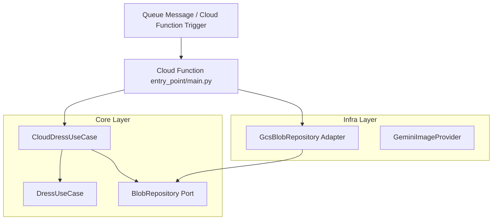

# `dressCloudFunction` Implementation Plan

## 1. Overview
This document outlines the architectural plan for implementing the `dressCloudFunction`, a Google Cloud Function triggered by a queue message (such as Google Cloud Tasks or Google Cloud Pub/Sub). The function processes virtual try-on requests by orchestrating:
1. Downloading the input outfit and person images from Google Cloud Storage (GCS) to a temporary local directory.
2. Executing the core dressing operation using the existing `DressUseCase`.
3. Uploading the resulting image back to a destination GCS bucket.
4. Cleaning up temporary files to prevent memory leak issues (since `/tmp` in Cloud Functions is backed by memory).

This design strictly adheres to the Clean Architecture principles outlined in [cleanArchitecture.md](file:///home/user/dressed-to-impress/prompts/cleanArchitecture.md) and incorporates comprehensive structured logging for easy troubleshooting and monitoring.

---

## 2. Architecture & Flow

Dependencies point inward towards the Core. We maintain complete separation between core logic, external infrastructure (GCS, Gemini), and the Cloud Function trigger mechanism.



### Flow of Operations

1. **Queue Message** received by the Cloud Function trigger containing:
   - `person_image` (relative path or full URI `gs://...`)
   - `outfit_image` (relative path or full URI `gs://...`)
   - `output_image_name` (filename or full URI `gs://...`)
2. **Cloud Function Entry Point** (`main.py`) acts as the **Composition Root**. It:
   - Sets up logging configurations.
   - Validates the payload.
   - Extracts bucket configurations (falling back to environment variables like `INPUT_BUCKET` and `OUTPUT_BUCKET`).
   - Instantiates the adapters: `GcsBlobRepository` and `GeminiImageProvider`.
   - Passes them to `CloudDressUseCase`.
3. **CloudDressUseCase** (Core Usecase) orchestrates:
   - Resolves a unique temporary local workspace (e.g. `/tmp/dress_<uuid>`).
   - Downloads blobs using the `BlobRepository` port.
   - Runs the existing `DressUseCase` with local paths.
   - Uploads the generated file to GCS using the `BlobRepository` port.
   - Cleans up the temporary workspace directory.
   - Returns a structured `AppResult[str]`.

---

## 3. Core Layer Extensions

We will extend the `core` layer to support cloud execution natively and maintain testability.

### 3.1 Port: `BlobRepository`
Defined in [blob_repository.py](file:///home/user/dressed-to-impress/dressed_to_impress/core/ports/blob_repository.py):
```python
from abc import ABC, abstractmethod

class BlobRepository(ABC):
    @abstractmethod
    def download_to_file(self, bucket_name: str, blob_name: str, local_path: str) -> None:
        """Download an object from the specified bucket to a local path.
        
        Raises InfraError on failure.
        """
        pass

    @abstractmethod
    def upload_from_file(self, local_path: str, bucket_name: str, blob_name: str) -> None:
        """Upload a local file to the specified storage bucket.
        
        Raises InfraError on failure.
        """
        pass
```

### 3.2 Command: `CloudDressCommand`
Defined in [cloud_dress_command.py](file:///home/user/dressed-to-impress/dressed_to_impress/core/commands/cloud_dress_command.py):
```python
from dataclasses import dataclass

@dataclass(frozen=True)
class CloudDressCommand:
    person_image_uri: str  # gs://bucket/path/person.png or path/person.png
    outfit_image_uri: str  # gs://bucket/path/outfit.jpg or path/outfit.jpg
    output_image_name: str # path/dressed.png
    prompt_override: str | None = None
```

### 3.3 Use Case: `CloudDressUseCase`
Defined in [cloud_dress_use_case.py](file:///home/user/dressed-to-impress/dressed_to_impress/core/use_cases/cloud_dress_use_case.py):
```python
import os
import shutil
import uuid
import logging
from urllib.parse import urlparse
from ..commands.cloud_dress_command import CloudDressCommand
from ..commands.dress_command import DressCommand
from ..ports.blob_repository import BlobRepository
from ..ports.errors import InfraError
from ..use_cases.dress_use_case import DressUseCase
from ..results.app_result import AppResult

logger = logging.getLogger(__name__)

class CloudDressUseCase:
    def __init__(
        self,
        blob_repo: BlobRepository,
        dress_use_case: DressUseCase,
        default_input_bucket: str,
        default_output_bucket: str,
        temp_dir_base: str = "/tmp"
    ) -> None:
        self._blob_repo = blob_repo
        self._dress_use_case = dress_use_case
        self._default_input_bucket = default_input_bucket
        self._default_output_bucket = default_output_bucket
        self._temp_dir_base = temp_dir_base

    def execute(self, cmd: CloudDressCommand) -> AppResult[str]:
        logger.info(
            "Starting CloudDressUseCase execution with person_uri=%s, outfit_uri=%s, output_name=%s",
            cmd.person_image_uri, cmd.outfit_image_uri, cmd.output_image_name
        )

        # 1. Parse URI and bucket names
        try:
            p_bucket, p_blob = self._parse_uri(cmd.person_image_uri, self._default_input_bucket)
            o_bucket, o_blob = self._parse_uri(cmd.outfit_image_uri, self._default_input_bucket)
            out_bucket, out_blob = self._parse_uri(cmd.output_image_name, self._default_output_bucket)
            logger.debug(
                "Parsed GCS URIs: person=gs://%s/%s, outfit=gs://%s/%s, output=gs://%s/%s",
                p_bucket, p_blob, o_bucket, o_blob, out_bucket, out_blob
            )
        except ValueError as err:
            logger.warning("URI parsing failed validation: %s", err)
            return AppResult.invalid([str(err)])

        # 2. Setup isolated temp directory
        run_id = str(uuid.uuid4())
        work_dir = os.path.join(self._temp_dir_base, f"dress_{run_id}")
        
        local_person = os.path.join(work_dir, "person" + os.path.splitext(p_blob)[1])
        local_outfit = os.path.join(work_dir, "outfit" + os.path.splitext(o_blob)[1])
        local_output = os.path.join(work_dir, "output" + os.path.splitext(out_blob)[1])

        logger.debug("Creating isolated local working directory: %s", work_dir)
        os.makedirs(work_dir, exist_ok=True)

        try:
            # 3. Download files from bucket
            logger.info("Downloading person image from gs://%s/%s -> %s", p_bucket, p_blob, local_person)
            self._blob_repo.download_to_file(p_bucket, p_blob, local_person)
            
            logger.info("Downloading outfit image from gs://%s/%s -> %s", o_bucket, o_blob, local_outfit)
            self._blob_repo.download_to_file(o_bucket, o_blob, local_outfit)

            # 4. Invoke local DressUseCase
            local_cmd = DressCommand(
                person_image_path=local_person,
                outfit_image_path=local_outfit,
                output_path=local_output,
                prompt_override=cmd.prompt_override
            )
            
            logger.info("Executing core DressUseCase locally")
            result = self._dress_use_case.execute(local_cmd)
            
            if not result.success:
                logger.error(
                    "Core DressUseCase execution failed. Validation: %s, Message: %s",
                    result.validation_errors, result.message
                )
                return AppResult.failure(f"Core execution failed: {result.message or result.validation_errors}")

            # 5. Upload to destination bucket
            logger.info("Uploading output to gs://%s/%s from local path %s", out_bucket, out_blob, local_output)
            self._blob_repo.upload_from_file(local_output, out_bucket, out_blob)
            
            destination_uri = f"gs://{out_bucket}/{out_blob}"
            logger.info("Successfully completed CloudDressUseCase. Output uploaded to: %s", destination_uri)
            return AppResult.ok(destination_uri, "Process executed successfully.")
            
        except InfraError as exc:
            logger.exception("Infrastructure failure during cloud dress execution: %s", exc)
            return AppResult.failure(f"Infrastructure failure: {exc}")
        except Exception as exc:
            logger.exception("Unhandled exception during cloud dress execution: %s", exc)
            return AppResult.failure(f"Unexpected error: {exc}")
        finally:
            # 6. Cleanup local filesystem to prevent memory leaks in Cloud Functions
            logger.debug("Cleaning up local working directory: %s", work_dir)
            try:
                shutil.rmtree(work_dir)
                logger.debug("Cleanup successful.")
            except Exception as cleanup_err:
                logger.warning("Failed to clean up workspace directory %s: %s", work_dir, cleanup_err)

    def _parse_uri(self, uri: str, default_bucket: str) -> tuple[str, str]:
        if uri.startswith("gs://"):
            parsed = urlparse(uri)
            bucket = parsed.netloc
            blob = parsed.path.lstrip("/")
            if not bucket or not blob:
                raise ValueError(f"Invalid GCS URI: {uri}")
            return bucket, blob
        return default_bucket, uri
```

---

## 4. Infrastructure Layer Extensions

We introduce a concrete GCS adapter that implements the `BlobRepository` port.

### 4.1 Adapter: `GcsBlobRepository`
Defined in [gcs_blob_repository.py](file:///home/user/dressed-to-impress/dressed_to_impress/infra/gcs_blob_repository.py):
```python
from google.cloud import storage
from ..core.ports.blob_repository import BlobRepository
from ..core.ports.errors import InfraError

class GcsBlobRepository(BlobRepository):
    def __init__(self, client: storage.Client | None = None) -> None:
        self._client = client or storage.Client()

    def download_to_file(self, bucket_name: str, blob_name: str, local_path: str) -> None:
        try:
            bucket = self._client.bucket(bucket_name)
            blob = bucket.blob(blob_name)
            blob.download_to_filename(local_path)
        except Exception as exc:
            raise InfraError(f"Failed to download blob gs://{bucket_name}/{blob_name}: {exc}") from exc

    def upload_from_file(self, local_path: str, bucket_name: str, blob_name: str) -> None:
        try:
            bucket = self._client.bucket(bucket_name)
            blob = bucket.blob(blob_name)
            blob.upload_from_filename(local_path)
        except Exception as exc:
            raise InfraError(f"Failed to upload {local_path} to gs://{bucket_name}/{blob_name}: {exc}") from exc
```

---

## 5. Delivery Layer: Google Cloud Function Trigger

The cloud function receives queue events. We support two common patterns: **Pub/Sub Trigger** or **Cloud Tasks (HTTP Trigger)**.

### 5.1 Cloud Function Code (`gcp_function/main.py`)
```python
import json
import os
import sys
import logging
import functions_framework
from google.cloud import storage

from dressed_to_impress.core.commands.cloud_dress_command import CloudDressCommand
from dressed_to_impress.core.use_cases.dress_use_case import DressUseCase
from dressed_to_impress.core.use_cases.cloud_dress_use_case import CloudDressUseCase
from dressed_to_impress.infra.filesystem_image_repository import FilesystemImageRepository
from dressed_to_impress.infra.gemini_image_provider import GeminiImageProvider
from dressed_to_impress.infra.gcs_blob_repository import GcsBlobRepository

# Configure logging to write structured output to stdout (which Google Cloud Logging captures)
LOG_LEVEL = os.environ.get("LOG_LEVEL", "INFO").upper()
logging.basicConfig(
    level=getattr(logging, LOG_LEVEL, logging.INFO),
    format="%(asctime)s [%(levelname)s] %(name)s: %(message)s",
    stream=sys.stdout
)
logger = logging.getLogger("dressCloudFunction")

# Global configuration from Env Vars
INPUT_BUCKET = os.environ.get("INPUT_BUCKET", "dressed-to-impress-inputs")
OUTPUT_BUCKET = os.environ.get("OUTPUT_BUCKET", "dressed-to-impress-outputs")
GEMINI_API_KEY = os.environ.get("GEMINI_API_KEY")

# Composition Root for the Cloud Function (Lazy initialization for performance)
_cloud_use_case = None

def get_cloud_use_case() -> CloudDressUseCase:
    global _cloud_use_case
    if _cloud_use_case is None:
        logger.info("Initializing composition root for cloud function...")
        if not GEMINI_API_KEY:
            logger.critical("GEMINI_API_KEY environment variable is not configured. Execution cannot proceed.")
            raise RuntimeError("GEMINI_API_KEY environment variable is not configured.")
        
        # Core & Infra wiring
        logger.info("Instantiating GcsBlobRepository, FilesystemImageRepository, and GeminiImageProvider")
        blob_repo = GcsBlobRepository()
        local_repo = FilesystemImageRepository()
        gemini_provider = GeminiImageProvider(api_key=GEMINI_API_KEY)
        
        dress_use_case = DressUseCase(repo=local_repo, provider=gemini_provider)
        _cloud_use_case = CloudDressUseCase(
            blob_repo=blob_repo,
            dress_use_case=dress_use_case,
            default_input_bucket=INPUT_BUCKET,
            default_output_bucket=OUTPUT_BUCKET
        )
        logger.info("CloudDressUseCase successfully initialized.")
    return _cloud_use_case

# Entry point for Pub/Sub triggers
@functions_framework.cloud_event
def dress_pubsub_handler(cloud_event) -> None:
    """Triggered from a message on a Cloud Pub/Sub topic."""
    event_id = cloud_event.data.get("message", {}).get("messageId", "unknown")
    logger.info("Received Pub/Sub cloud event with messageId: %s", event_id)
    try:
        # Pub/Sub payload is base64 encoded in cloud_event.data["message"]["data"]
        import base64
        pubsub_data = cloud_event.data["message"]["data"]
        message_str = base64.b64decode(pubsub_data).decode("utf-8")
        payload = json.loads(message_str)
        logger.debug("Decoded Pub/Sub payload for messageId %s: %s", event_id, payload)
    except Exception as exc:
        logger.exception("Failed to parse Pub/Sub message payload for event %s: %s", event_id, exc)
        return

    _execute_payload(payload)

# Entry point for HTTP triggers (e.g. Cloud Tasks)
@functions_framework.http
def dress_http_handler(request):
    """Triggered from an HTTP POST request (e.g., from Cloud Tasks)."""
    logger.info("Received HTTP request to dress_http_handler. Method: %s", request.method)
    if request.method != "POST":
        logger.warning("Method %s rejected. Only POST method is accepted.", request.method)
        return "Only POST method is accepted", 405

    try:
        payload = request.get_json(silent=True)
        if not payload:
            logger.warning("Empty or invalid JSON body received in HTTP request.")
            return "Invalid JSON body", 400
    except Exception as exc:
        logger.exception("Error parsing HTTP request JSON payload: %s", exc)
        return f"Error parsing JSON payload: {exc}", 400

    result = _execute_payload(payload)
    if result.success:
        return {"status": "success", "output_uri": result.value}, 200
    
    if result.validation_errors:
        return {"status": "validation_error", "errors": result.validation_errors}, 400
    return {"status": "failure", "message": result.message}, 500

def _execute_payload(payload: dict):
    # Parse payload fields
    person_image = payload.get("person_image")
    outfit_image = payload.get("outfit_image")
    output_image_name = payload.get("output_image_name")
    prompt_override = payload.get("prompt_override")

    logger.info(
        "Processing execution payload: person_image=%s, outfit_image=%s, output_image_name=%s",
        person_image, outfit_image, output_image_name
    )

    cmd = CloudDressCommand(
        person_image_uri=person_image,
        outfit_image_uri=outfit_image,
        output_image_name=output_image_name,
        prompt_override=prompt_override
    )

    try:
        use_case = get_cloud_use_case()
        result = use_case.execute(cmd)
        
        if result.success:
            logger.info("✓ Successfully processed dress execution. Output uploaded to: %s", result.value)
        else:
            logger.error(
                "✗ Failed to process dress execution. Validation: %s, Error: %s",
                result.validation_errors, result.message
            )
        return result
    except Exception as exc:
        logger.exception("Unexpected exception inside _execute_payload: %s", exc)
        return AppResult.failure(f"Unexpected internal failure: {exc}")
```

---

## 6. Logging & Troubleshooting Strategy

To facilitate troubleshooting and health-monitoring in production, the design follows standard Cloud Logging best practices:

### 6.1 Log Levels
- `DEBUG`: Used for fine-grained workflow details (e.g., specific paths in `/tmp`, URI parsing breakdowns, cleanup receipts).
- `INFO`: Captures start and end points of core actions (e.g., event delivery, download start/finish, Gemini local execution, upload completed).
- `WARNING`: Used for validation issues (e.g. invalid URIs) or expected transient filesystem retry attempts.
- `ERROR`: Captures pipeline failures (e.g., local usecase failure, SDK timeouts, failed downloads/uploads). Accompanied by full tracebacks.
- `CRITICAL`: Used for missing environmental requirements (e.g., missing API keys) where the function cannot spin up.

### 6.2 Monitoring & Alerts
1. **Error Rate Monitoring**: Set up a log-based metric in Google Cloud Monitoring targeting `resource.type="cloud_function"` AND `severity>=ERROR`. Create an alerting policy if the metric goes above 0 in a 5-minute window.
2. **Execution Time (Latency) Tracking**: Measure execution duration to identify if download times or Gemini image generation latency spike.
3. **Execution ID Correlation**: Since Cloud Functions prints standard output to Google Cloud Logging, execution IDs are automatically correlated per request in Gen 2. `getLogger` will use local scope identifiers to ensure trace contexts align.

---

## 7. Testing Strategy

We extend the test suite with unit tests and integration tests adhering to the Clean Architecture patterns.

### 7.1 Unit Testing the Cloud Use Case
We write tests using an in-memory `FakeBlobRepository` and mocking the underlying `DressUseCase`.

Defined in [test_cloud_dress_use_case.py](file:///home/user/dressed-to-impress/tests/core/test_cloud_dress_use_case.py):
```python
import pytest
from dressed_to_impress.core.commands.cloud_dress_command import CloudDressCommand
from dressed_to_impress.core.use_cases.cloud_dress_use_case import CloudDressUseCase
from dressed_to_impress.core.ports.errors import InfraError
from tests.fakes import FakeImageRepository, FakeImageGenerationProvider
from dressed_to_impress.core.use_cases.dress_use_case import DressUseCase

class FakeBlobRepository:
    def __init__(self, existing_blobs=None):
        self.blobs = existing_blobs or {}
        self.downloads = []
        self.uploads = []

    def download_to_file(self, bucket_name, blob_name, local_path):
        key = f"gs://{bucket_name}/{blob_name}"
        if key not in self.blobs:
            raise InfraError(f"Blob not found: {key}")
        self.downloads.append((bucket_name, blob_name, local_path))
        with open(local_path, "wb") as f:
            f.write(self.blobs[key])

    def upload_from_file(self, local_path, bucket_name, blob_name):
        self.uploads.append((local_path, bucket_name, blob_name))
        with open(local_path, "rb") as f:
            self.blobs[f"gs://{bucket_name}/{blob_name}"] = f.read()

def test_cloud_use_case_happy_path(tmp_path):
    # Setup fakes
    blobs = {
        "gs://in-bucket/person.png": b"person-bytes",
        "gs://in-bucket/outfit.png": b"outfit-bytes",
    }
    blob_repo = FakeBlobRepository(blobs)
    
    # We can inject a standard DressUseCase with local fakes
    local_repo = FakeImageRepository({
        str(tmp_path / "person.png"): b"person-bytes",
        str(tmp_path / "outfit.png"): b"outfit-bytes",
    })
    provider = FakeImageGenerationProvider(result=b"output-image-bytes")
    dress_use_case = DressUseCase(repo=local_repo, provider=provider)

    cloud_use_case = CloudDressUseCase(
        blob_repo=blob_repo,
        dress_use_case=dress_use_case,
        default_input_bucket="in-bucket",
        default_output_bucket="out-bucket",
        temp_dir_base=str(tmp_path)
    )

    cmd = CloudDressCommand(
        person_image_uri="gs://in-bucket/person.png",
        outfit_image_uri="gs://in-bucket/outfit.png",
        output_image_name="dressed_output.png"
    )

    result = cloud_use_case.execute(cmd)

    assert result.success
    assert result.value == "gs://out-bucket/dressed_output.png"
    assert "gs://out-bucket/dressed_output.png" in blob_repo.blobs
    assert blob_repo.blobs["gs://out-bucket/dressed_output.png"] == b"output-image-bytes"
```

---

## 8. Deployment Instructions

To deploy the Cloud Function to Google Cloud Platform:

```bash
gcloud functions deploy dressCloudFunction \
    --gen2 \
    --runtime=python310 \
    --region=us-central1 \
    --entry-point=dress_pubsub_handler \
    --trigger-topic=dress-execution-requests \
    --set-env-vars="GEMINI_API_KEY=your_gemini_api_key,INPUT_BUCKET=your_input_bucket,OUTPUT_BUCKET=your_output_bucket,LOG_LEVEL=INFO"
```

For Cloud Tasks integration, deploy using HTTP trigger option:
```bash
gcloud functions deploy dressCloudFunctionHttp \
    --gen2 \
    --runtime=python310 \
    --region=us-central1 \
    --entry-point=dress_http_handler \
    --trigger-http \
    --no-allow-unauthenticated \
    --set-env-vars="GEMINI_API_KEY=your_gemini_api_key,INPUT_BUCKET=your_input_bucket,OUTPUT_BUCKET=your_output_bucket,LOG_LEVEL=INFO"
```
