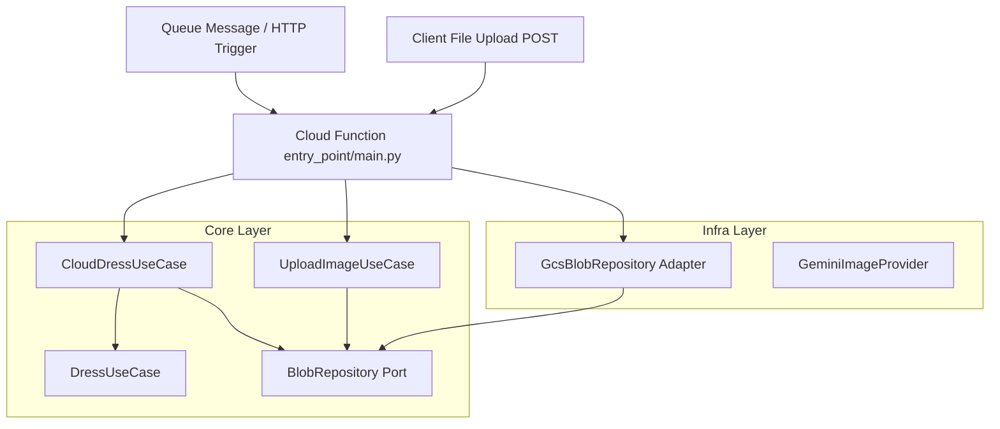

# `dressCloudFunction` Implementation Plan

## 1. Overview
This document outlines the architectural plan for implementing the `dressCloudFunction`, a Google Cloud Function triggered by a queue message (such as Google Cloud Tasks or Google Cloud Pub/Sub) or HTTP endpoints. It supports:
1. **Virtual Try-on Execution** (`dressCloudFunction`): Downloads person and outfit images from Google Cloud Storage (GCS), executes the core try-on operation using `DressUseCase`, uploads the output to GCS, and cleans up the temporary workspace.
2. **File Uploading** (`upload_handler`): Receives image files via HTTP POST (multipart/form-data), validates their file extension support (e.g. `.png`, `.jpg`, `.jpeg`, `.webp`), uploads them to a GCS bucket, and returns their GCS path.

This design strictly adheres to the Clean Architecture principles outlined in [cleanArchitecture.md](file:///home/user/dressed-to-impress/prompts/cleanArchitecture.md) and incorporates comprehensive structured logging.

---

## 2. Architecture & Flow

Dependencies point inward towards the Core. We maintain complete separation between core logic, external infrastructure (GCS, Gemini), and the Cloud Function trigger mechanisms.



### Flow of Operations

#### A. Dress Execution Trigger
1. **Queue Message** received containing paths/URIs for the person image, outfit image, and output filename.
2. **Cloud Function** instantiates the `CloudDressUseCase` and runs it.
3. **CloudDressUseCase** downloads the files, executes the local `DressUseCase` inside an isolated workspace under `/tmp`, uploads the result to GCS, cleans up `/tmp`, and returns the GCS output URI.

#### B. File Upload Trigger
1. **Client POST Request** made to `/upload` as multipart/form-data containing the `file` and optional `bucket` parameter.
2. **Cloud Function** reads the file bytes, instantiates `UploadImageUseCase`, and executes it.
3. **UploadImageUseCase** validates the extension format, uploads the file content to GCS via a temporary file using the `BlobRepository` port, and returns the public `gs://...` URI.

---

## 3. Core Layer Extensions

We extend the `core` layer with commands and use cases to make both dress operations and file uploads testable.

### 3.1 Port: `BlobRepository`
Defined in [blob_repository.py](file:///home/user/dressed-to-impress/dressed_to_impress/core/ports/blob_repository.py):
```python
from abc import ABC, abstractmethod

class BlobRepository(ABC):
    @abstractmethod
    def download_to_file(self, bucket_name: str, blob_name: str, local_path: str) -> None:
        """Download an object from GCS to local path."""
        pass

    @abstractmethod
    def upload_from_file(self, local_path: str, bucket_name: str, blob_name: str) -> None:
        """Upload a local file to GCS."""
        pass
```

### 3.2 Commands
#### `CloudDressCommand` in [cloud_dress_command.py](file:///home/user/dressed-to-impress/dressed_to_impress/core/commands/cloud_dress_command.py):
```python
from dataclasses import dataclass

@dataclass(frozen=True)
class CloudDressCommand:
    person_image_uri: str
    outfit_image_uri: str
    output_image_name: str
    prompt_override: str | None = None
```

#### `UploadImageCommand` in [upload_image_command.py](file:///home/user/dressed-to-impress/dressed_to_impress/core/commands/upload_image_command.py):
```python
from dataclasses import dataclass

@dataclass(frozen=True)
class UploadImageCommand:
    filename: str
    data: bytes
    bucket_name: str | None = None
```

### 3.3 Use Cases
#### `CloudDressUseCase` in [cloud_dress_use_case.py](file:///home/user/dressed-to-impress/dressed_to_impress/core/use_cases/cloud_dress_use_case.py):
Handles downloads, local try-on orchestration, upload, and `/tmp` cleanup. (See source code for full implementation details).

#### `UploadImageUseCase` in [upload_image_use_case.py](file:///home/user/dressed-to-impress/dressed_to_impress/core/use_cases/upload_image_use_case.py):
```python
import os
import tempfile
import logging
from ..commands.upload_image_command import UploadImageCommand
from ..ports.blob_repository import BlobRepository
from ..ports.errors import InfraError
from ..results.app_result import AppResult

logger = logging.getLogger(__name__)
SUPPORTED_EXTENSIONS = (".png", ".jpg", ".jpeg", ".webp")

class UploadImageUseCase:
    def __init__(self, blob_repo: BlobRepository, default_bucket: str) -> None:
        self._blob_repo = blob_repo
        self._default_bucket = default_bucket

    def execute(self, cmd: UploadImageCommand) -> AppResult[str]:
        logger.info("Executing UploadImageUseCase for filename=%s", cmd.filename)
        errors = []
        if not cmd.filename or not cmd.filename.strip():
            errors.append("Filename is required")
            ext = ""
        else:
            _, ext = os.path.splitext(cmd.filename.lower())
            if ext not in SUPPORTED_EXTENSIONS:
                errors.append(f"Unsupported file type. Must be one of {', '.join(SUPPORTED_EXTENSIONS)}")

        if not cmd.data:
            errors.append("File content data is empty or missing")

        if errors:
            return AppResult.invalid(errors)

        target_bucket = cmd.bucket_name or self._default_bucket
        safe_name = os.path.basename(cmd.filename)

        try:
            with tempfile.NamedTemporaryFile(delete=False, suffix=ext) as temp_file:
                temp_file.write(cmd.data)
                temp_path = temp_file.name

            self._blob_repo.upload_from_file(temp_path, target_bucket, safe_name)
            os.remove(temp_path)

            gcs_uri = f"gs://{target_bucket}/{safe_name}"
            return AppResult.ok(gcs_uri, "File uploaded successfully.")
        except Exception as exc:
            return AppResult.failure(f"Upload failed: {exc}")
```

---

## 4. Delivery Layer: Cloud Function Entry Point

Defined in [main.py](file:///home/user/dressed-to-impress/gcp_function/main.py):
* Configures logging severity.
* Houses lazy composition roots `get_cloud_use_case()` and `get_upload_use_case()`.
* Exports `dress_pubsub_handler(cloud_event)`, `dress_http_handler(request)`, and `upload_handler(request)`.

---

## 5. Logging & Troubleshooting Strategy
Refer to source files for complete details. Log levels (`DEBUG`, `INFO`, `WARNING`, `ERROR`, `CRITICAL`) are set via the `LOG_LEVEL` environment variable. Standard output stream format aligns with Google Cloud Logging ingestion formatting.

---

## 6. Testing Strategy

### 6.1 Unit Tests
Defined in [test_cloud_dress_use_case.py](file:///home/user/dressed-to-impress/tests/core/test_cloud_dress_use_case.py):
* Validates happy path downloads/uploads using in-memory fakes.
* Validates validation logic (empty filename, invalid file extensions).
* Validates connection/infrastructure failure conversions to app results.

---

## 7. Deployment Instructions

### Deploy Try-on Queue Trigger (Pub/Sub Trigger)
```bash
gcloud functions deploy dressCloudFunction \
    --gen2 \
    --runtime=python310 \
    --region=us-central1 \
    --entry-point=dress_pubsub_handler \
    --trigger-topic=dress-execution-requests \
    --set-env-vars="GEMINI_API_KEY=your_gemini_api_key,INPUT_BUCKET=your_input_bucket,OUTPUT_BUCKET=your_output_bucket,LOG_LEVEL=INFO"
```

### Deploy HTTP Upload Endpoint
```bash
gcloud functions deploy dressUploadFunction \
    --gen2 \
    --runtime=python310 \
    --region=us-central1 \
    --entry-point=upload_handler \
    --trigger-http \
    --no-allow-unauthenticated \
    --set-env-vars="INPUT_BUCKET=your_input_bucket,LOG_LEVEL=INFO"
```
